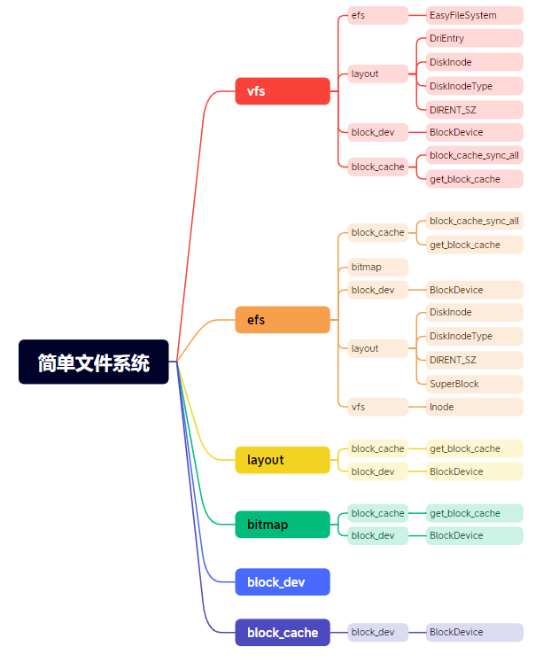

# Doc in Xmind

To use it, you should download Xmind first. 
Its not a easy-to-use software. I just use it to record the structure I have as I read the code. If you are looking for development documentation, go to the doc folder. If you want to know the structure of the file system, go to xmind and read it **AFTER** read the code.

## Preview part of the xmind

### src.xmind

### npucore-fat32.xmind 

