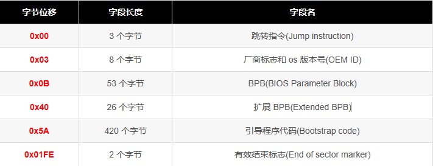

# fat32文件系统

## easy file system

- 超级块 保存基本信息

- 索引节点位图 哪些节点是有效的

- 索引节点区域 保存文件的具体哪些数据块

- 数据块位图 指导文件添加的内存块分配过程

- 数据块区域 数据区域

## fat32 file system

- boot sector(引导扇区) 
    - 获取FAT占用cluster总数及reserved clusters 总数，计算出Root Directory位置
    - 根目录开始地址 = ((保留扇区数) + (每 FAT 扇区数) * (FAT 数)) * 扇区字节数
    - 
- FAT1
    - 从Root floder中找到起始簇号，然后在FAT表中查询下一个簇号
- FAT2
- Root Directory
    - 短文件格式
    - 长文件格式
    - 文件地址 = 根目录开始地址 + ((起始簇号 - 根目录簇号(Root Cluster Number)) * 每簇扇区数(Sectors Per Cluster) * 扇区字节数(Bytes Per Sector))

### 疑问
- 在哪里维护未使用的数据块（答：FAT表）
- 文件夹的组织方式