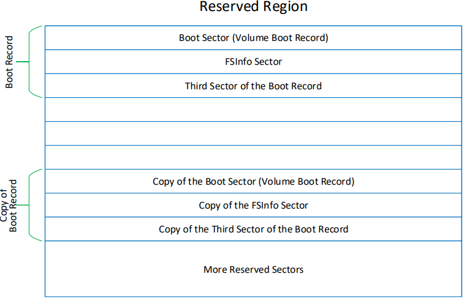
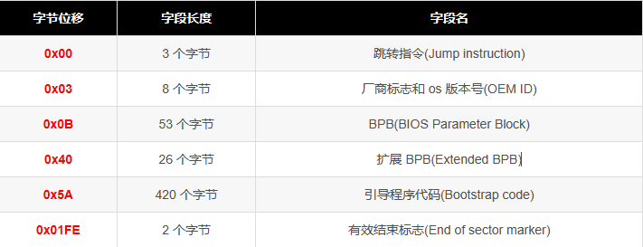
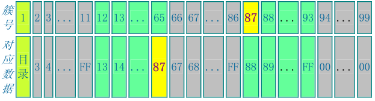

# fat32文件系统

## fat32 file system

- The Reserved Sectors
    - 该区域主要保存了boot sector(引导扇区) 以及FSInfo sector 
    - 
    - boot sector(引导扇区) 
        - 获取FAT占用cluster总数及reserved clusters 总数，计算出Root Directory位置
        - 根目录开始地址 = ((保留扇区数) + (每 FAT 扇区数) * (FAT 数)) * 扇区字节数
        - 
        - 在没有分区表的情况下，boot sector始终位于磁盘的第一个簇的第一个扇区中，其中保存了磁盘大小、每簇扇区数、每扇区字节数、FAT表的位置、根目录地址等基本信息，通过对boot sector的阅读获取文件系统的初始化信息
    - BPB_FSInfo 
        - 位于第二个扇区中
        - FSI_Nxt_Free 是一个建议的空闲簇的第一个簇
        - FSI_Free_Count 空闲簇数量
- FAT1
    - FAT表记录了磁盘数据文件的存储链表，对于数据的读取而言是极其重要的，以至于Microsoft为其开发的FAT文件系统中的FAT表创建了一份备份，就是我们看到的FAT2。FAT2 与FAT1 的内容通常是即时同步的，也就是说如果通过正常的系统读写对FAT1 做了更改，那么FAT2 也同样被更新。
    - 从Root floder中找到起始簇号，然后在FAT表中查询下一个扇区号
    - FAT 以簇为基本单位，记录磁盘的使用情况，可以指出当前簇是否被使用；如果被使用，下一个簇的位置，或者是否为空闲簇
    - 可以使用两个高阶 FAT[1] 位来指示卷是否干或卷在上次退出期间出现 I/O 错误
    - 
- FAT2 对第一个FAT表的拷贝
- Root Directory
    - 每一个目录项长32 Bytes
    - 短文件格式
        - 对于短文件名，系统将文件名分成两部分进行存储，即主文件名+扩展名。0x0~0x7字节记录文件的主文件名，0x8~0xA记录文件的扩展名，取文件名中的ASCII码值。不记录主文件名与扩展名之间的"."，主文件名不足 8 个字符以空白符(20H)填充，扩展名不足 3 个字符同样以空白符(20H)填充。0x00 偏移处的取值若为 00H，表明目录项为空；若为E5H，表明目录项曾被使用，但对应的文件或文件夹已被删除。(这也是误删除后恢复的理论依据)。文件名中的第一个字符若为“.”或“..”表示这个簇记录的是一个子目录的目录项。“.”代表当前目录；“..”代表上级目录。
        - 0x14 ~ 0x15和0x1A~0x1B文件起始簇号：它存放文件或目录的表示文件的起始簇号，系统根据掌握的起始簇号在FAT表中找到入口，然后再跟踪簇链直至簇尾，同时用 0x1C~0x1F处字节判定有效性。就可以完全无误的读取文件(目录)了。
        - 
    - 长文件格式
        - FAT32 的一个重要的特点是完全支持长文件名。长文件名依然是记录在目录项中的。为了低版本的 OS 或程序能正确读取长文件名文件，系统自动为所有长文件名文件创建了一个对应的短文件名，使 对应数据既可以用长文件名寻址，也可以用短文件名寻址。不支持长文件名的 OS 或程序会忽略它认为不合法的长文件名字段，而支持长文件名的 OS 或程序则会以长文件名为显式项来记录和编辑，并隐藏起短文件名。
        - 长文件名的实现有赖于目录项偏移为 0xB 的属性字节，当此字节的属性为：只读、隐藏、系统、卷标，即其值为 0FH 时，DOS 和 WIN32 会认为其不合法而忽略其存在。系统将长文件名以 13 个字符为单位进行切割，每一组占据一个目录项。所以可能一个文件需要多个目录项，这时长文件名的 各个目录项按倒序排列在目录表中，以防与其他文件名混淆。长文件名中的字符采用 unicode 形式编码，每个字符占据 2 字节的空间。
        - 
    - 文件地址 = 根目录开始地址 + ((起始簇号 - 根目录簇号(Root Cluster Number)) * 每簇扇区数(Sectors Per Cluster) * 扇区字节数(Bytes Per Sector))

## 主要代码解析
本系统使用的是去年参赛团队npucore的fat32文件系统，并在此基础上进行修改,在复赛期间对文件系统进行重构
### /fs/fat32/bitmap.rs
该文件主要定义了FAT相关的结构
#### 使用的crate

- BlockDevice
- Cache
- BlockCacheManager

#### fat结构的定义

- fat_cache_mgr 使用的设备
- start_block_id FAT开始扇区
- byts_per_sec 每扇区字节
- tot_ent 总共的FAT数量
- vacant_clus 空闲簇队列
- hint 最新未使用簇号

#### 在对外开放的接口中，开放了新建FAT表对象，空闲簇的释放与收集工作

### fs/fat32/layout

该文件主要提供了文件的打开标志定义OpenFlags、文件模式标志StatMode、文件属性Stat、目录项Dirent

### /fs/fat32/dir_iter

#### 使用的crate

- layout
	- FATDirEnt
	- FatShortDirEnt
- vfs
	- InodeLock
	- Inode

#### 枚举 DirIterMode

#### DirIter结构体

- 属性
	- inode_lock
	- offset
	- mode：DirIterMode
	- direction
	- inode
- 功能
    - 定义了目录项在内核中的具体存储形势，并为其实现了Iterator，可以以迭代器的形式进行访问

#### DirWalker结构体
- DirIter外面套了一层，可以包括长文件名与短文件名

### /fs/fat32/efs

主体结构为FAT表，并记录了文件系统的部分信息

### /fs/fat32/inode

文件系统在内核中的具体存储格式，其实现主体为Inode与目录
```
pub struct OSInode {
    readable: bool,
    writable: bool,
    /// See `DirectoryTreeNode` for more details
    special_use: bool,
    append: bool,
    inner: Arc<InodeImpl>,
    offset: Mutex<usize>,
    dirnode_ptr: Arc<Mutex<Weak<DirectoryTreeNode>>>,
}
```

### /fs/fat32/vfs

根据定义的File trait，属性如下：
```
pub struct Inode {
    /// Inode lock: for normal operation
    inode_lock: RwLock<InodeLock>,
    /// File Content
    file_content: RwLock<FileContent>,
    /// File cache manager corresponding to this inode.
    file_cache_mgr: PageCacheManager,
    /// File type
    file_type: Mutex<DiskInodeType>,
    /// The parent directory of this inode
    parent_dir: Mutex<Option<(Arc<Self>, u32)>>,
    /// file system
    fs: Arc<EasyFileSystem>,
    /// Struct to hold time related information
    time: Mutex<InodeTime>,
    /// Info Inode to delete file content
    deleted: Mutex<bool>,
}
```

## TODO


该文件系统是居于rCore的easyFileSystem重构而来，因此各个模块之间的层级关系不清晰，甚至有同名文件进行在不同文件夹下多次定义的情况，这造成了代码关系混乱不清晰，以及存在两个文件互相调用的情况，不符合我们高内聚低耦合的思想，因此计划在复赛进行重构，预期结构如下：
- cache 基于block中对磁盘的访问，进行内存中的cache，该层并不区分fat32的各种结构
- bitmap(FAT) 实现对于FAT表的维护，同时对磁盘的使用情况进行管理
- layout 对于保留扇区中的结构进行定义，并开放初始化与读取接口
- dir-iter 实现对于目录项的维护，其内容需要基于bitmap与cache与layout
- file_inode 对于文件的维护，其内容需要基于bitmap与cache与layout
- Inode 对于file_inode与dir-iter进行整合，其内容为对于一个目录项或文件的各种访问，按照对于访问文件的需求封装函数
- efs 对Inode进行进一步封装，按照系统需要的各种功能封装函数
- vfs 对整个系统文件的管理器，包含该系统的所有信息，在其中实现相关syscall
- mod 集合文件系统的各个模块，并在其中定义文件系统的全局变量
- 将stdio、pipe的内容移入drivers中

现阶段文件系统中有两个结构体实现了file特性，这两个结构体还存在互相之间的调用，我计划将其缩减，统一到OsInode中的针对于系统的功能函数实现File trait


